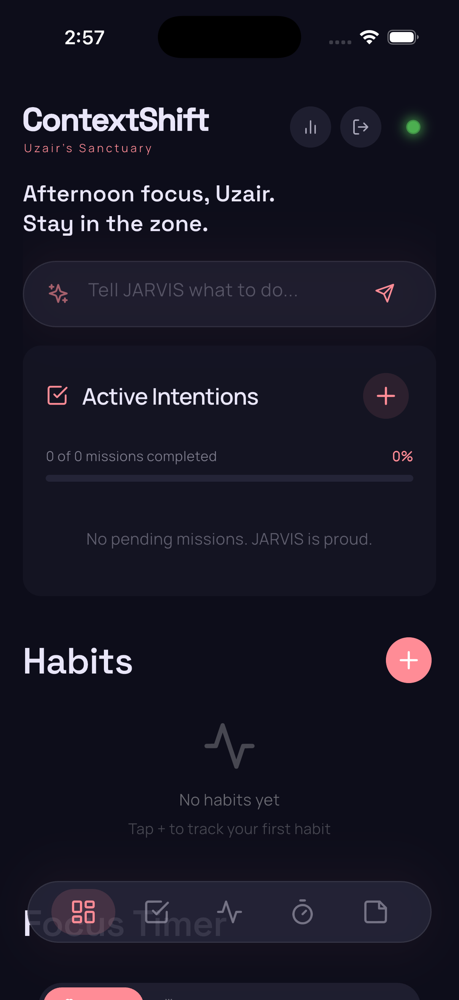
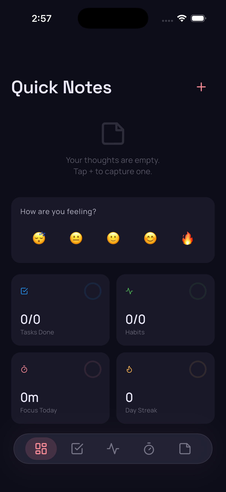
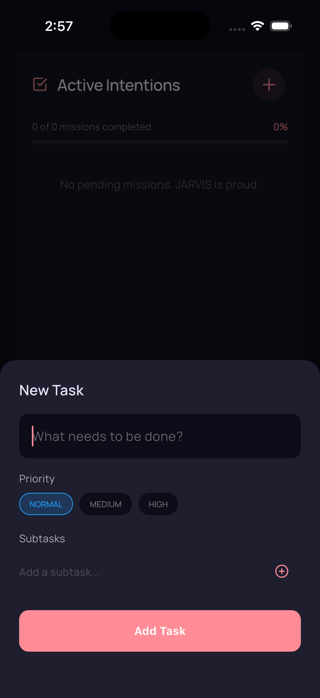
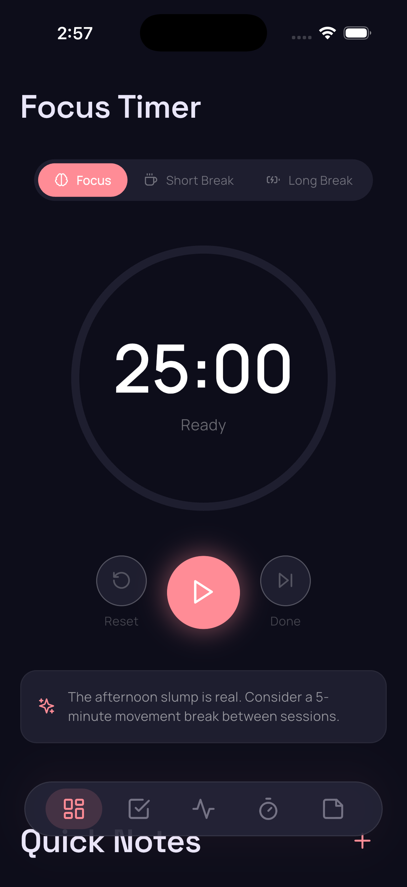
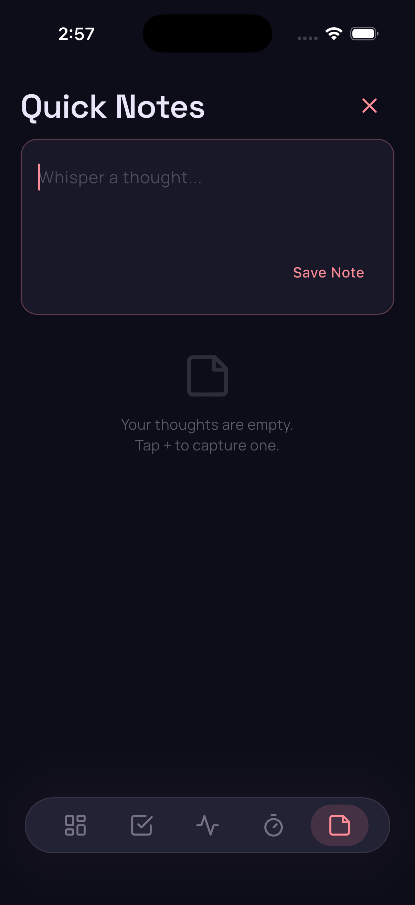
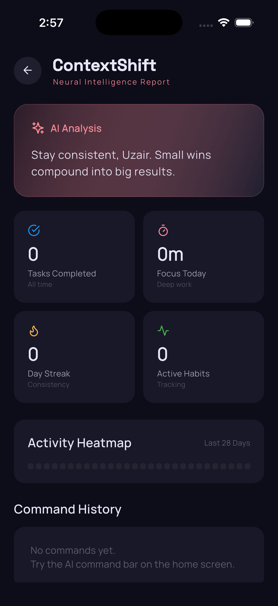

# ContextShift

ContextShift is a cross-platform Flutter productivity app built around a simple idea: your workspace should adapt to your current mental context instead of forcing you into a static dashboard.

The product combines task management, habits, focus sessions, notes, mood check-ins, and an on-device AI layer called JARVIS. JARVIS can interpret commands, hold local chat conversations, generate adaptive GenUI surfaces, and personalize responses using recent activity, profile context, and local memory — all running locally with no server or cloud dependency for day-to-day use.

## Product Goal

Most productivity apps are good at storing information, but weak at helping people restart, refocus, and decide what matters next.

ContextShift is designed to become a:

- Re-entry workspace for people coming back after distraction or overload
- Context-aware daily operating system for tasks, habits, notes, and focus
- Lightweight AI copilot that can reshape the interface around your current intent

The app is fully offline-first with no account requirement:

- No sign-up or login needed — guest-only with a device-local identity
- Everything is stored in a local SQLite database
- AI runs on-device via Google Gemma models (no API keys or internet needed for inference)
- Native platform code is kept minimal and app-owned, including local storage checks for large model downloads

## What We Have Built So Far

### Core app experience

- Responsive Flutter app with a modular home dashboard
- Bottom navigation for Home, Tasks, Habits, Focus, and Notes
- Animated tab switching and animated module reordering
- Premium dark visual system using glassmorphism, gradients, and editorial typography

### Onboarding and access flow

- Multi-screen animated onboarding for first launch
- Optional Gemma E2B model download screen
- Guest-only flow using UUID-based device identity
- Guest profile capture for name, focus area, and support needs

### Productivity modules

- Tasks with priority and subtasks
- Habit tracking with emoji-based habit icons and daily completion state
- Focus sessions with saved duration data
- Notes module for quick capture
- Mood check-in using emoji states

### AI layer

- JARVIS command bar on the home screen
- Dedicated JARVIS chat screen with conversation history
- Keyword-based local command parsing (instant, no model needed)
- On-device Gemma NLU fallback when the model is loaded
- GenUI/A2UI surface generation for plans, dashboards, routines, and structured responses
- Local JARVIS memory for conversation summaries, user preferences, goals, routines, and constraints
- Local insight generation for dashboard summaries

## Screenshots

The current screenshots are available in [`assets/screenshots/`](assets/screenshots/) and cover the workspace, productivity modules, notes, focus, and AI insights.

<p>
  
  
  
  
  
  
</p>

### Personalization and behavior context

- Local SQLite database scoped by device UUID
- Behavior event logging for key interactions
- Context snapshot assembly before AI requests
- User profile context, mood, top tasks, missing habits, recent notes, recent commands, and recent events attached to JARVIS requests
- Conversation summaries and learned local user memories attached to JARVIS chat and GenUI requests

## Architecture

For a visual overview of how the Flutter app, local database, on-device Gemma
model, JARVIS memory, and GenUI runtime fit together, see
[docs/architecture.md](docs/architecture.md).

### Flutter app

The Flutter application is the sole client and contains:

- App bootstrap and launch gating in [lib/main.dart](lib/main.dart)
- Screens for onboarding, guest profile, model download, and home
- Modular UI widgets for tasks, habits, notes, focus, AI dashboard, and generative cards
- Service classes for local database and on-device AI

The home screen is built as a modular workspace rather than one large monolithic page. The app can reorder modules and change responses based on AI output.

### Data layer (local SQLite)

All data is stored locally using [Drift](https://drift.simonbinder.eu/) SQLite ORM:

| Table | Purpose |
|-------|---------|
| `ProfileTable` | User profile (name, focus area, support need, model tier) |
| `UserPreferencesTable` | Device preferences (response style, onboarding state, model tier) |
| `TaskTable` | Tasks with priority, due dates, subtasks |
| `HabitTable` | Habits with emoji icons, daily completion history |
| `FocusSessionTable` | Focus timer sessions |
| `NoteTable` | Notes with content, tags, summaries |
| `MoodEntryTable` | Mood check-ins |
| `AiCommandTable` | AI command history |
| `BehaviorEventTable` | Local behavior events used to shape context |
| `ConversationTable` | Chat conversations |
| `ConversationMemoryTable` | Rolling summaries and open questions for JARVIS conversations |
| `JarvisMemoryTable` | Local learned facts, preferences, goals, routines, and constraints |
| `MessageTable` | Individual chat messages |

The main data access layer lives in [lib/core/database/database_service.dart](lib/core/database/database_service.dart).

### On-device AI models

AI currently runs locally using [FlutterGemma](https://pub.dev/packages/flutter_gemma) with one supported model tier:

- **E2B** (free, about 2.6 GB): 4096-token LiteRT-LM context window, requires 4 GB RAM

The 4096-token figure is the complete context window (prompt plus generated
output). JARVIS uses separate output budgets for natural chat and structured
cards so the model has useful room without allowing runaway generation on a
mobile device.

Model files are downloaded from HuggingFace with progress tracking, cancel/retry controls, and storage checks. Feature gates are controlled by [FeatureManager](lib/core/services/feature_manager.dart).

### AI command processing (two-stage)

1. **Keyword pattern matching** — instant parsing for common commands (add task, start focus, take note, etc.). No model needed.
2. **Gemma NLU fallback** — if the keyword parser doesn't match and the on-device model is loaded, the command is sent to Gemma for structured JSON action extraction.
3. **Model-unavailable state** — if the local model is not ready, JARVIS says so explicitly; it does not silently create a task from an unrecognized message.

Insights are generated locally based on time of day and recent activity patterns. GenUI surfaces are generated through an allow-listed catalog of safe Flutter/A2UI components so the model can compose useful interfaces without arbitrary runtime code execution.

## Technical Stack

### Frontend

- Flutter
- Dart
- Material 3
- `lucide_icons`

### Local data

- Drift (SQLite ORM)
- `sqlite3_flutter_libs`
- `shared_preferences`

### On-device AI

- `flutter_gemma` (Google Gemma models)
- `genui`

### Services

- `path_provider`
- `uuid`
- app-owned native storage channel for model download capacity checks

### Utilities

- `path`

## Important Files

- [lib/main.dart](lib/main.dart) — App bootstrap, database initialization, model gate, onboarding gate
- [lib/core/database/database_service.dart](lib/core/database/database_service.dart) — Drift database service with full CRUD, reactive streams, context snapshot builder
- [lib/core/database/schema.dart](lib/core/database/schema.dart) — Drift table definitions
- [lib/core/ai_service.dart](lib/core/ai_service.dart) — Local command parsing, keyword matching, Gemma NLU fallback, insight generation
- [lib/core/ai/jarvis_memory_service.dart](lib/core/ai/jarvis_memory_service.dart) — Local JARVIS memory and conversation summaries
- [lib/core/genui/genui_runtime.dart](lib/core/genui/genui_runtime.dart) — Gemma-backed GenUI runtime with planning, safe rendering, and labeled local fallback
- [lib/core/local_llm/gemma_service.dart](lib/core/local_llm/gemma_service.dart) — FlutterGemma wrapper (init, load, generate, streaming)
- [lib/core/local_llm/model_downloader.dart](lib/core/local_llm/model_downloader.dart) — HuggingFace model download with progress and cancel/retry behavior
- [lib/core/local_llm/model_tier.dart](lib/core/local_llm/model_tier.dart) — Supported Gemma E2B model definition
- [lib/core/services/feature_manager.dart](lib/core/services/feature_manager.dart) — Feature gating based on model tier
- [lib/core/services/device_storage_service.dart](lib/core/services/device_storage_service.dart) — Platform channel for available/total storage
- [lib/presentation/screens/home/home_screen.dart](lib/presentation/screens/home/home_screen.dart) — Main workspace, bottom navigation, JARVIS launcher, insight card
- [lib/presentation/screens/chat/chat_screen.dart](lib/presentation/screens/chat/chat_screen.dart) — JARVIS chat, dictation, generated UI, and history drawer
- [lib/presentation/screens/onboarding/onboarding_screen.dart](lib/presentation/screens/onboarding/onboarding_screen.dart) — First-run onboarding flow

## How JARVIS Works

1. The app builds a context snapshot from the local database (profile, mood, tasks, habits, notes, focus, events, conversation memory)
2. You type or dictate a command in the JARVIS bar or chat screen
3. `AiService` processes it locally:
   - First tries keyword/pattern matching (instant, no model)
   - If no match and Gemma is loaded, sends to on-device Gemma for NLU parsing
   - Shows a clear local-model-not-ready state when Gemma cannot answer an unrecognized request
4. GenUI requests go through a planning prompt and catalog-constrained surface generation, with a labeled local fallback if Gemma times out or does not produce a visible surface
5. The AI response adapts the UI (adds tasks, starts focus, shows insights, generates cards, or renders an A2UI surface)
6. Conversation summaries and explicitly learned user facts are saved locally so future interactions become more contextual

No backend server or API keys are needed for day-to-day use. Network access is
only needed when the optional E2B model is downloaded.

## Running the Project

```bash
flutter pub get
flutter run
```

The app works immediately with no backend, no Firebase configuration, and no API keys. Optional model download happens during onboarding.

## Model Setup

During onboarding, you'll be prompted to download the E2B model (free, about 2.6 GB). This enables on-device chat and generated surfaces.

The model requires an arm64 device (Android) or a supported iOS/macOS runtime. Desktop platforms may not load Gemma and can fall back to local parsing.

## Product Direction

ContextShift is strongest when it is not just another AI productivity app.

The most promising direction is to make it a context recovery and decision-support tool:

- help users restart after distraction
- compress overwhelm into the next clear move
- adapt plans based on mood and energy
- make the interface feel more like a responsive operating system than a note-taking container

That product direction already matches the current architecture well:

- modular UI
- behavioral logging
- mood input
- AI-driven layout changes
- user-context-aware prompting
- fully local and private

## Status Summary

ContextShift today is a fully offline-first adaptive productivity app with:

- a polished onboarding flow
- guest-only local identity (no accounts)
- local SQLite database with reactive streams
- on-device AI with the supported E2B model tier
- modular adaptive UI foundations
- zero server or cloud dependencies
