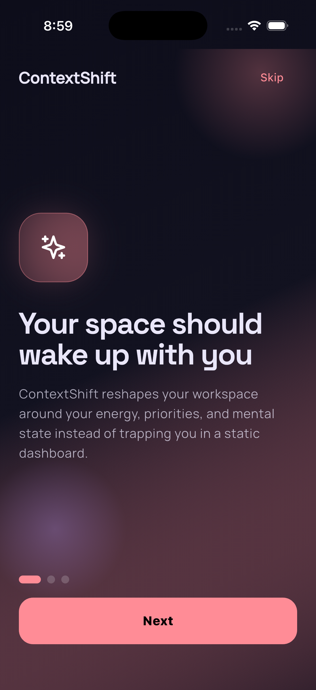
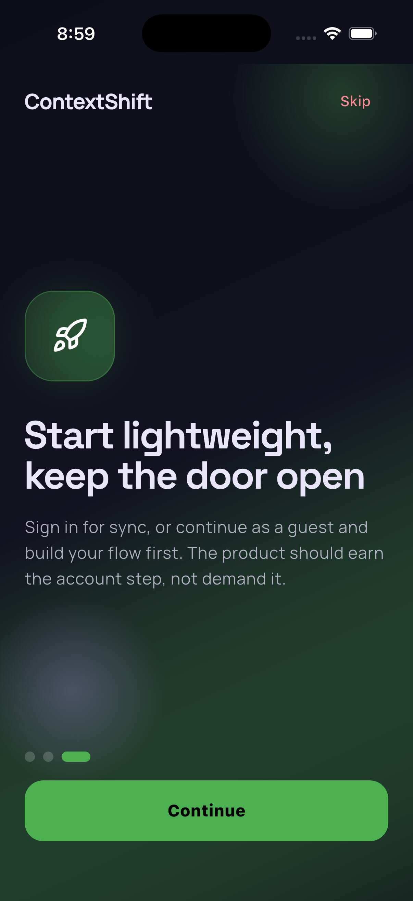
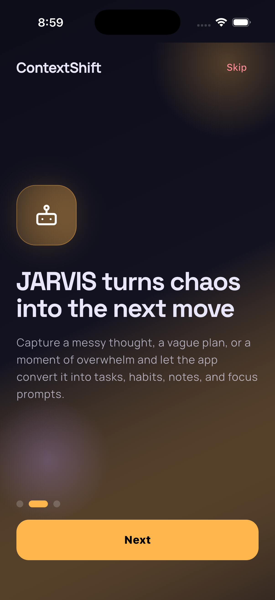
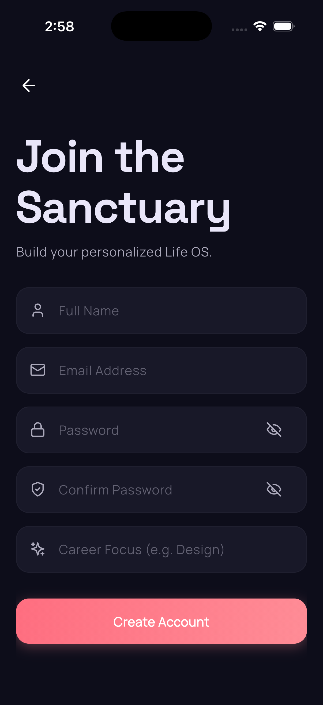
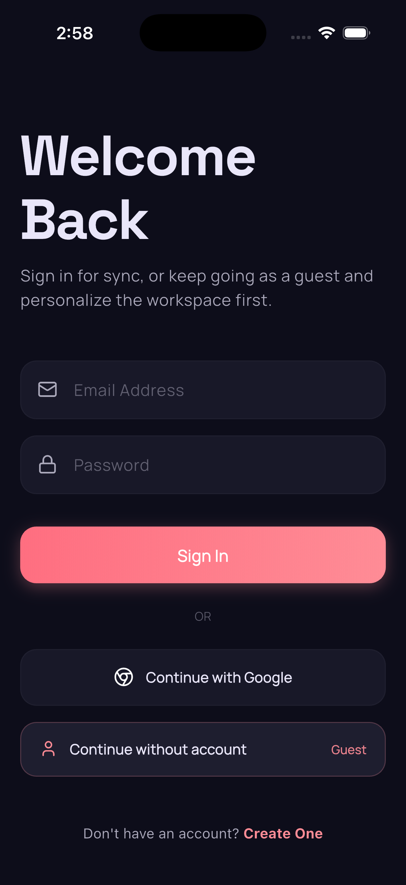

# ContextShift

ContextShift is a cross-platform Flutter productivity app built around a simple idea: your workspace should adapt to your current mental context instead of forcing you into a static dashboard.

The product combines task management, habits, focus sessions, notes, mood check-ins, and an on-device AI layer called JARVIS. JARVIS can interpret commands, generate adaptive cards, and personalize responses using your recent activity and profile context — all running locally with no server or cloud dependencies.

## Product Goal

Most productivity apps are good at storing information, but weak at helping people restart, refocus, and decide what matters next.

ContextShift is designed to become a:

- Re-entry workspace for people coming back after distraction or overload
- Context-aware daily operating system for tasks, habits, notes, and focus
- Lightweight AI copilot that can reshape the interface around your current intent

The app is fully offline-first with no account requirement:

- No sign-up or login needed — guest-only with a device-local identity
- Everything is stored in a local SQLite database
- AI runs on-device via Google Gemma models (no API keys or internet needed for inference)
- Firebase is used only for optional Crashlytics crash reporting

## What We Have Built So Far

### Core app experience

- Responsive Flutter app with a modular home dashboard
- Bottom navigation for Home, Tasks, Habits, Focus, and Notes
- Animated tab switching and animated module reordering
- Premium dark visual system using glassmorphism, gradients, and editorial typography

### Onboarding and access flow

- Multi-screen animated onboarding for first launch
- Optional Gemma model download screen (E2B free tier or E4B paid tier)
- Guest-only flow using UUID-based device identity
- Guest profile capture for name, focus area, and support needs

### Productivity modules

- Tasks with priority and subtasks
- Habit tracking with emoji-based habit icons and daily completion state
- Focus sessions with saved duration data
- Notes module for quick capture
- Mood check-in using emoji states

### AI layer

- JARVIS command bar on the home screen
- Keyword-based local command parsing (instant, no model needed)
- On-device Gemma NLU fallback when the model is loaded
- Adaptive card generation for planning, advice, and routines
- Local insight generation for dashboard summaries

## Screenshots

The images are available in `assets/screenshots/` and cover the app's onboarding, login, home dashboard, AI insight, focus mode, and notes flows.

<div>
  
  
</div>

<div>
  
  
</div>

<div>
  
  
</div>

<div>
  
  
</div>

<div>
  
  
</div>

<div>
  
</div>

### Personalization and behavior context

- Local SQLite database scoped by device UUID
- Behavior event logging for key interactions
- Context snapshot assembly before AI requests
- User profile context, mood, top tasks, missing habits, recent notes, recent commands, and recent events attached to JARVIS requests

## Architecture

### Flutter app

The Flutter application is the sole client and contains:

- App bootstrap and launch gating in [lib/main.dart](lib/main.dart)
- Screens for onboarding, guest profile, model download, and home
- Modular UI widgets for tasks, habits, notes, focus, AI dashboard, and generative cards
- Service classes for local database and on-device AI

The home screen is built as a modular workspace rather than one large monolithic page. The app can reorder modules and change responses based on AI output.

### Data layer (local SQLite)

All data is stored locally using [Drift](https://drift.simonbinder.eu/) SQLite ORM:

| Table | Purpose |
|-------|---------|
| `ProfileTable` | User profile (name, focus area, support need, model tier) |
| `UserPreferencesTable` | Device preferences (response style, onboarding state, model tier) |
| `TaskTable` | Tasks with priority, due dates, subtasks |
| `HabitTable` | Habits with emoji icons, daily completion history |
| `FocusSessionTable` | Focus timer sessions |
| `NoteTable` | Notes with content, tags, summaries |
| `MoodEntryTable` | Mood check-ins |
| `AiCommandTable` | AI command history |
| `BehaviorEventTable` | Analytics events |
| `ConversationTable` | Chat conversations |
| `MessageTable` | Individual chat messages |

The main data access layer lives in [lib/core/database/database_service.dart](lib/core/database/database_service.dart).

### On-device AI models

AI runs locally using [FlutterGemma](https://pub.dev/packages/flutter_gemma) with two model tiers:

- **E2B** (free, 2.4 GB): Up to 2048 tokens, requires 4 GB RAM
- **E4B** (paid, 4.3 GB): Up to 4096 tokens, requires 8 GB RAM, unlocks advanced features

Model files are downloaded from HuggingFace with progress tracking, pause/resume, and storage checks. Feature gates controlled by [FeatureManager](lib/core/services/feature_manager.dart).

### AI command processing (two-stage)

1. **Keyword pattern matching** — instant parsing for common commands (add task, start focus, take note, etc.). No model needed.
2. **Gemma NLU fallback** — if the keyword parser doesn't match and the on-device model is loaded, the command is sent to Gemma for structured JSON action extraction.
3. **Default fallback** — unrecognized input with >5 characters creates a task with the full text.

Insights are generated locally based on time of day and recent activity patterns.

## Technical Stack

### Frontend

- Flutter
- Dart
- Material 3
- `google_fonts`
- `lucide_icons`

### Local data

- Drift (SQLite ORM)
- `sqlite3_flutter_libs`
- `shared_preferences`

### On-device AI

- `flutter_gemma` (Google Gemma models)
- `genui`

### Services

- Firebase Core + Crashlytics (crash reporting only)
- `path_provider`
- `uuid`

### Utilities

- `http`
- `path`

## Important Files

- [lib/main.dart](lib/main.dart) — App bootstrap, database initialization, model gate, onboarding gate
- [lib/core/database/database_service.dart](lib/core/database/database_service.dart) — Drift database service with full CRUD, reactive streams, context snapshot builder
- [lib/core/database/schema.dart](lib/core/database/schema.dart) — Drift table definitions (11 tables)
- [lib/core/ai_service.dart](lib/core/ai_service.dart) — Local command parsing, keyword matching, Gemma NLU fallback, insight generation
- [lib/core/local_llm/gemma_service.dart](lib/core/local_llm/gemma_service.dart) — FlutterGemma wrapper (init, load, generate, streaming)
- [lib/core/local_llm/model_downloader.dart](lib/core/local_llm/model_downloader.dart) — HuggingFace model download with progress and resume
- [lib/core/local_llm/model_tier.dart](lib/core/local_llm/model_tier.dart) — Model tier definitions (E2B, E4B)
- [lib/core/services/feature_manager.dart](lib/core/services/feature_manager.dart) — Feature gating based on model tier
- [lib/presentation/screens/home_screen.dart](lib/presentation/screens/home_screen.dart) — Main workspace, bottom navigation, AI bar, insight card
- [lib/presentation/screens/onboarding_screen.dart](lib/presentation/screens/onboarding_screen.dart) — First-run onboarding flow

## How JARVIS Works

1. The app builds a context snapshot from the local database (profile, mood, recent tasks, habits, notes, events)
2. You type a command in the JARVIS bar
3. `AiService` processes it locally:
   - First tries keyword/pattern matching (instant, no model)
   - If no match and Gemma is loaded, sends to on-device Gemma for NLU parsing
   - Falls back to creating a task with the full text
4. The AI response adapts the UI (adds tasks, starts focus, shows insights, generates cards)

No network requests, no backend server, no API keys needed for day-to-day use.

## Running the Project

```bash
flutter pub get
flutter run
```

The app works immediately with no backend, no Firebase configuration, and no API keys. Optional model download happens during onboarding.

## Model Setup

During onboarding, you'll be prompted to download the E2B model (free, 2.4 GB). This enables on-device NLU for richer command parsing. The E4B model (paid, 4.3 GB) unlocks advanced features:

- Unlimited chat history
- Custom personality
- Weekly reviews
- Advanced insights

Both models require an arm64 device (Android) or iOS 16+ / macOS. Desktop platforms won't load Gemma and fall back to pattern-only parsing.

## Product Direction

ContextShift is strongest when it is not just another AI productivity app.

The most promising direction is to make it a context recovery and decision-support tool:

- help users restart after distraction
- compress overwhelm into the next clear move
- adapt plans based on mood and energy
- make the interface feel more like a responsive operating system than a note-taking container

That product direction already matches the current architecture well:

- modular UI
- behavioral logging
- mood input
- AI-driven layout changes
- user-context-aware prompting
- fully local and private

## Status Summary

ContextShift today is a fully offline-first adaptive productivity app with:

- a polished onboarding flow
- guest-only local identity (no accounts)
- local SQLite database with reactive streams
- on-device AI with free and paid model tiers
- modular adaptive UI foundations
- zero server or cloud dependencies
