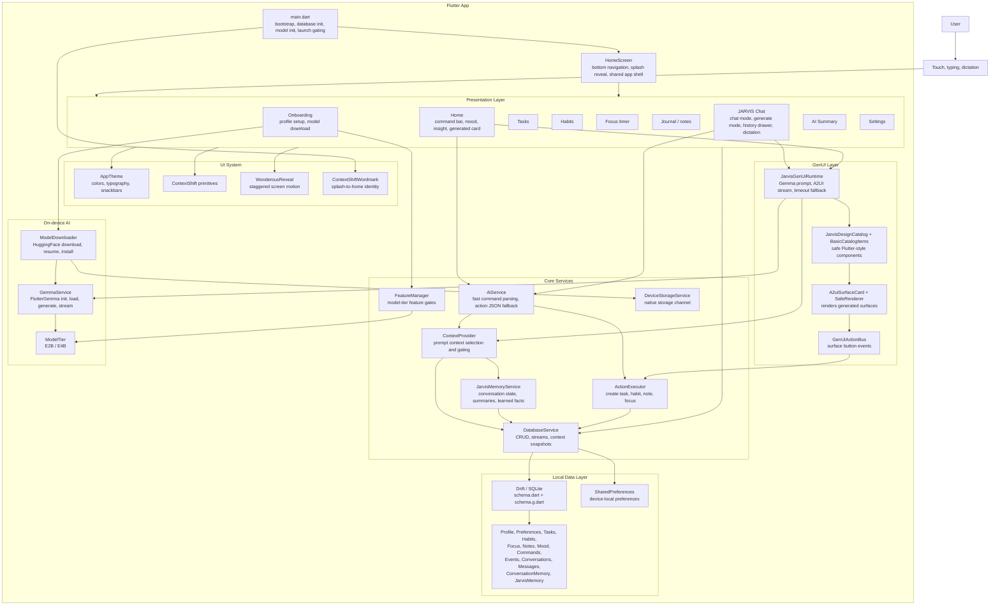
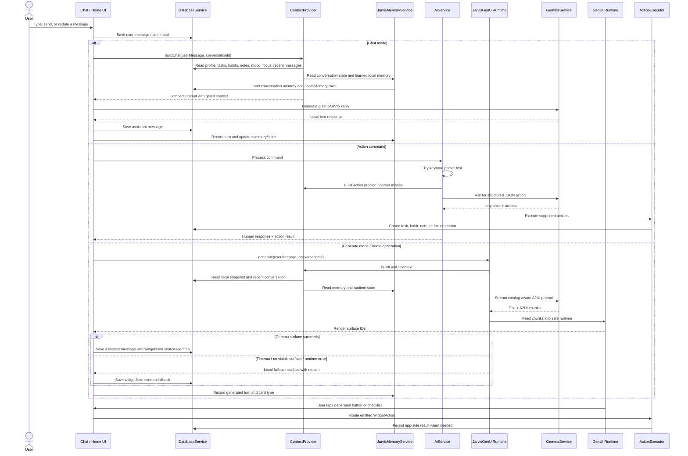
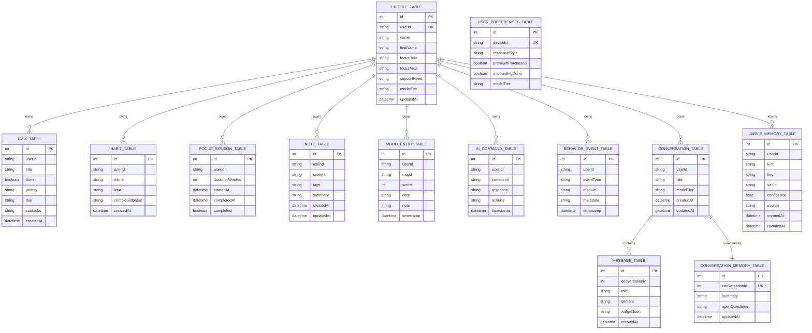

# ContextShift Architecture

ContextShift is an offline-first Flutter productivity system. The app combines
classic productivity modules with an on-device JARVIS layer that can chat,
execute app actions, build local context, and generate adaptive GenUI surfaces.

## System Architecture

## JARVIS And GenUI Flow

## Local Data Model

## Layer Responsibilities

| Layer | Responsibility | Key files |
| --- | --- | --- |
| App bootstrap | Initialize database, Gemma, launch routing, splash/home reveal | `lib/main.dart` |
| Presentation | Screens, modules, chat, generated-card rendering, motion | `lib/presentation/**` |
| Local data | Drift schema, CRUD, streams, context snapshots | `lib/core/database/schema.dart`, `lib/core/database/database_service.dart` |
| JARVIS context | Select relevant local context, recent messages, memory, runtime state | `lib/core/ai/context_provider.dart`, `lib/core/ai/jarvis_memory_service.dart` |
| Command actions | Parse commands and execute safe app mutations | `lib/core/ai_service.dart`, `lib/core/ai/action_executor.dart` |
| GenUI | Ask Gemma for A2UI, constrain to catalog, render safely, fall back locally | `lib/core/genui/**`, `lib/presentation/widgets/genui/a2ui_surface_card.dart` |
| Local model | Initialize, load, download, and run Gemma locally | `lib/core/local_llm/**` |
| Native support | Storage checks for large local model downloads | `lib/core/services/device_storage_service.dart` |

## Runtime Principles

- Local-first by default: user data, conversations, memories, and generated UI
  metadata are stored on device.
- Model-aware: the app can run without Gemma loaded, then unlock richer chat and
  GenUI once the model is available.
- Catalog-constrained GenUI: JARVIS can compose dynamic surfaces from safe,
  known widgets instead of executing arbitrary Flutter code at runtime.
- Context-gated prompting: JARVIS receives the smallest useful slice of local
  profile, productivity, memory, and conversation state for each mode.
- Recoverable generation: if Gemma times out or does not produce a visible
  surface, the runtime returns a labeled local fallback rather than crashing.
